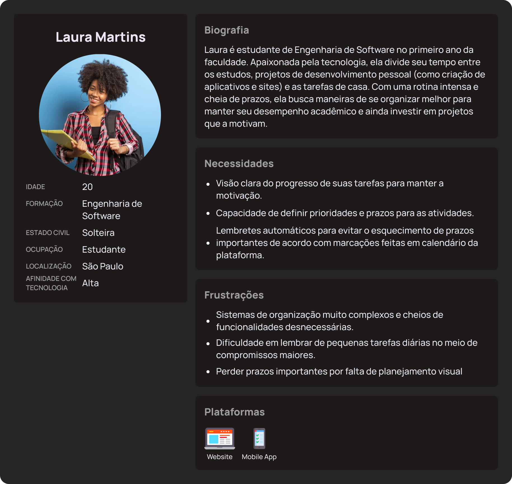
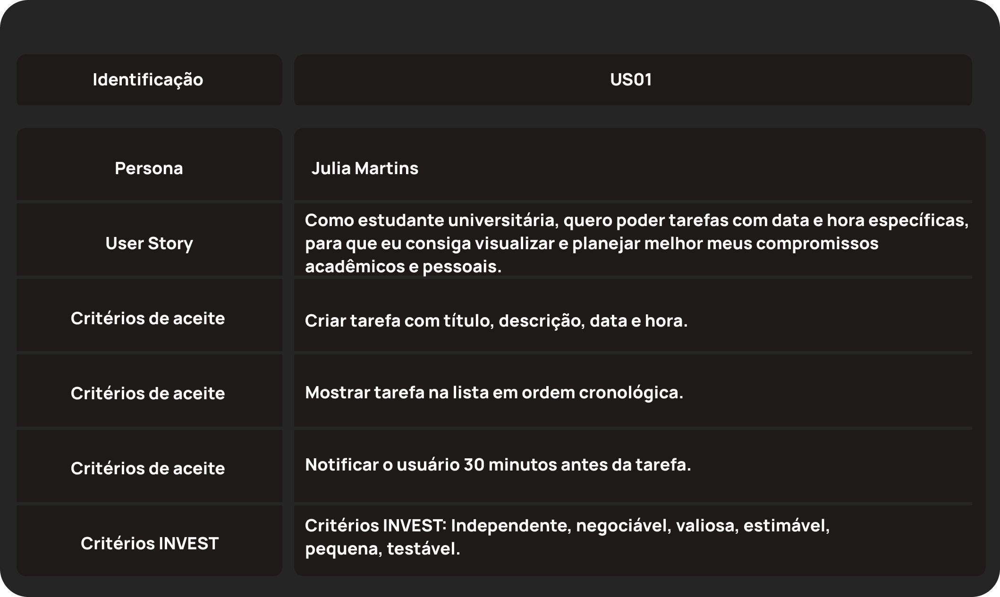
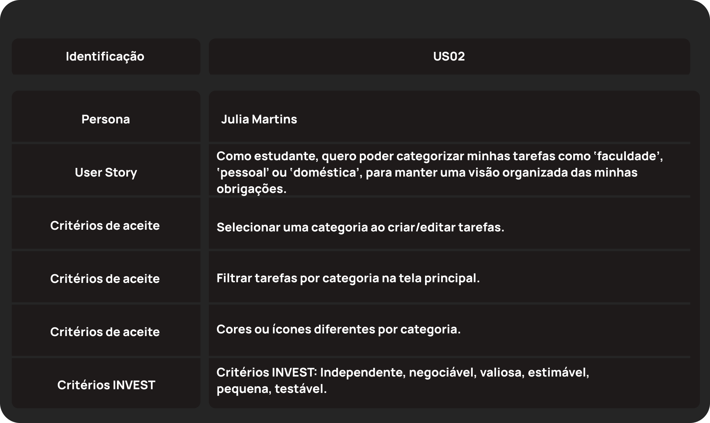
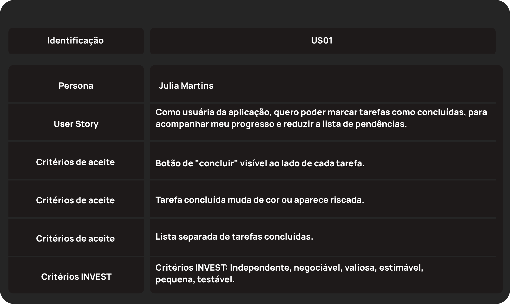
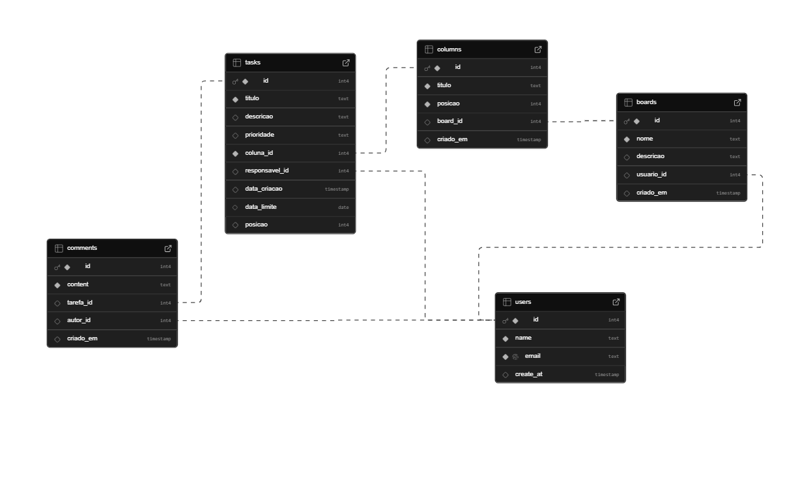
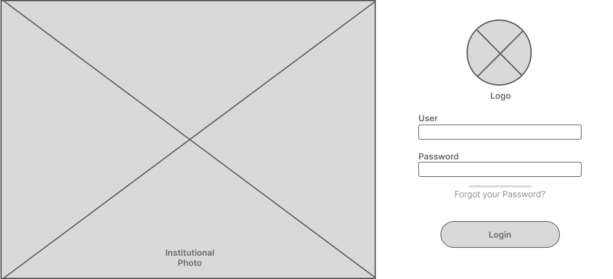
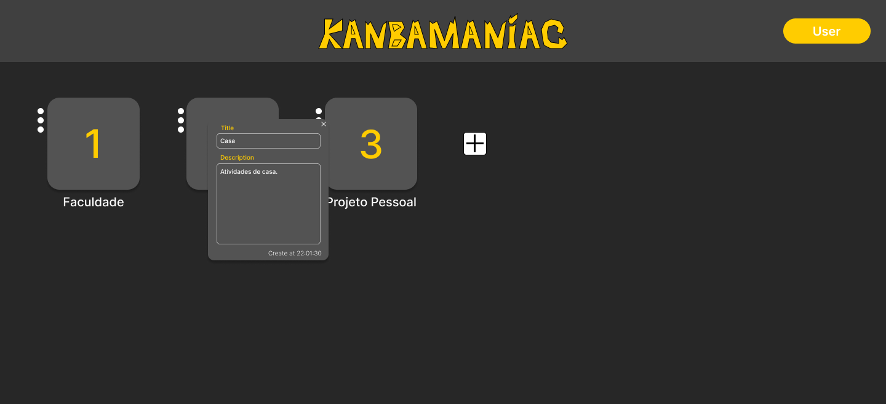

# Web Application Document - Projeto Individual - Módulo 2 - Inteli

**_Os trechos em itálico servem apenas como guia para o preenchimento da seção. Por esse motivo, não devem fazer parte da documentação final._**

## Nome do Projeto

#### Autor do projeto

## Sumário

1. [Introdução](#c1)  
2. [Visão Geral da Aplicação Web](#c2)  
3. [Projeto Técnico da Aplicação Web](#c3)  
4. [Desenvolvimento da Aplicação Web](#c4)  
5. [Referências](#c5)  

<br>

## <a name="c1"></a>1. Introdução (Semana 01)

O projeto consiste no desenvolvimento de uma aplicação web voltada para o gerenciamento de tarefas, com o objetivo de promover a organização pessoal e aumentar a produtividade dos usuários. A plataforma permite que os usuários criem, editem, visualizem e organizem suas tarefas diárias de forma prática e eficiente, auxiliando na gestão do tempo e no cumprimento de metas.
Entre as principais funcionalidades, destacam-se a criação de tarefas com prazos definidos, a categorização por prioridade, a marcação de estado (pendente, em andamento, concluída) e a possibilidade de edição e exclusão de atividades, tendo apoio em metodologias de produtividade, como os métodos kamban e SCRUM. Além disso, será implementado um sistema de notificação para lembrar os usuários de tarefas próximas ao vencimento, contribuindo para a organização contínua e a redução da procrastinação.
O desenvolvimento da aplicação utilizará tecnologias modernas como HTML, CSS, JavaScript e frameworks de apoio. O projeto também aplicará princípios de usabilidade e design centrado no usuário, buscando atender às necessidades reais de quem busca melhorar seu desempenho pessoal e profissional.

## <a name="c2"></a>2. Visão Geral da Aplicação Web

### 2.1. Personas (Semana 01)

<div align="center">
<sub align="center">Figura 1 – Persona</sub>
</div>

<div align="center">

</div>

<div align="center">
<sup>Source: Produzido pelo autor, 2025.</sup>
</div>


### 2.2. User Stories (Semana 01)

<div align="center">
<sub align="center">Figure 2 – User Story 01</sub>
</div>

<div align="center">

</div>

<div align="center">
<sup>Source: Produzido pelo autor, 2025.</sup>
</div>


| Critério | Análise |
|----------|---------|
| **I - Independente** | Sim. Pode ser desenvolvida sem depender de outras funcionalidades. |
| **N - Negociável**   | Sim. A forma como a tarefa é criada, validada ou exibida pode ser discutida com o time. |
| **V - Valiosa**      | Sim. Entrega valor direto ao usuário ao permitir melhor organização. |
| **E - Estimável**    | Sim. É possível estimar o esforço de desenvolvimento com clareza. |
| **S - Small**        | Sim. Tem escopo bem definido (criar tarefa + notificação). |
| **T - Testável**     | Sim. Pode ser testada funcionalmente e via interface. |

<div align="center">
<sub align="center">Figure 3 – User Story 02</sub>
</div>

<div align="center">

</div>

<div align="center">
<sup>Source: Produced by the team, 2025.</sup>
</div>

| Critério | Análise |
|----------|---------|
| **I - Independente** | Sim. A categorização pode ser implementada sem outras funcionalidades. |
| **N - Negociável**   | Sim. Pode-se negociar quais categorias usar ou como representar visualmente. |
| **V - Valiosa**      | Sim. Ajuda a organizar melhor diferentes áreas da vida do usuário. |
| **E - Estimável**    | Sim. As tarefas de desenvolvimento são claras e mensuráveis. |
| **S - Small**        | Sim. Pequena e objetiva. |
| **T - Testável**     | Sim. Pode ser testada por filtragem e visualização de categorias. |

<div align="center">
<sub align="center">Figure 4 – User Story 03</sub>
</div>

<div align="center">

</div>

<div align="center">
<sup>Source: Produced by the team, 2025.</sup>
</div>

| Critério | Análise |
|----------|---------|
| **I - Independente** | Sim. Não depende da criação de novas tarefas ou visualizações. |
| **N - Negociável**   | Sim. A forma como se marca ou representa a conclusão pode ser adaptada. |
| **V - Valiosa**      | Sim. Dá senso de progresso e alívio ao usuário. |
| **E - Estimável**    | Sim. Fácil de estimar tempo e esforço de implementação. |
| **S - Small**        | Sim. Tem escopo bastante reduzido. |
| **T - Testável**     | Sim. Pode ser testada pela alteração de status da tarefa. |

## <a name="c3"></a>3. Projeto da Aplicação Web

### 3.1. Modelagem do banco de dados  (Semana 3)

#### Esquema de Modelo Relacional

<div align="center">
<sub align="center">Figura 5 – Modelo Lógico - Banco de Dados</sub>
</div>

<div align="center">

</div>

<div align="center">
<sup>Source: Produzido pelo autor, 2025.</sup>
</div>

#### Modelo físico do Banco de Dados:

##### Criação de Tabelas

```jsx
-- Usuários (dono dos boards e possíveis responsáveis pelas tarefas)
create table users (
  id SERIAL PRIMARY KEY,
  name text not null,
  email TEXT UNIQUE NOT NULL,
  create_at timestamp default now()
);

-- Quadros Kanban (ex: "Projeto X") pertencem a um usuário
create table boards (
  id SERIAL PRIMARY KEY,
  nome text not null,
  descricao text,
  usuario_id int references users(id) on delete cascade,
  criado_em timestamp default now()
);

-- Colunas do board (ex: "A Fazer", "Fazendo", "Concluído") pertencem a um board
create table columns (
  id SERIAL PRIMARY KEY,
  titulo text not null,
  posicao integer not null,
  board_id int references boards(id) on delete cascade,
  criado_em timestamp default now()
);

-- Tarefas estão dentro de colunas e podem ter um responsável (user)
create table tasks (
  id SERIAL PRIMARY KEY,
  titulo text not null,
  descricao text,
  prioridade text check (prioridade in ('baixa', 'média', 'alta')) default 'média',
  coluna_id int not null references columns(id) on delete cascade,
  responsavel_id int references users(id) on delete set null,
  data_criacao timestamp default now(),
  data_limite date,
  posicao integer
);

-- Comentários pertencem a uma tarefa e têm um autor
create table comments (
  id SERIAL PRIMARY KEY,
  content text not null,
  tarefa_id  int references tasks(id) on delete cascade,
  autor_id int references users(id) on delete set null,
  criado_em timestamp default now()
);
```

##### Popular Tabela

```jsx
-- Preenchimento do banco de dados

-- Users
INSERT INTO users (name, email) VALUES
  ('Ana Souza', 'ana.souza@example.com'),
  ('Carlos Lima', 'carlos.lima@example.com'),
  ('Beatriz Ramos', 'bia.ramos@example.com'),
  ('Daniel Rocha', 'daniel.rocha@example.com');

-- Boards 
INSERT INTO boards (nome, descricao, usuario_id) VALUES
  ('Projeto App Fitness', 'Aplicativo de treinos personalizados', 1),
  ('TCC Engenharia', 'Gerenciamento do trabalho de conclusão de curso', 2);

-- Columns 
-- Para o board 1
INSERT INTO columns (titulo, posicao, board_id) VALUES
  ('A Fazer', 1, 1),
  ('Em Progresso', 2, 1),
  ('Concluído', 3, 1);

-- Para o board 2
INSERT INTO columns (titulo, posicao, board_id) VALUES
  ('Backlog', 1, 2),
  ('Desenvolvimento', 2, 2),
  ('Revisado', 3, 2);

-- tasks
-- Tarefas do board 1
INSERT INTO tasks (titulo, descricao, prioridade, coluna_id, responsavel_id, data_limite, posicao) VALUES
  ('Criar wireframe', 'Montar layout inicial no Figma', 'alta', 1, 1, '2025-05-15', 1),
  ('Implementar login', 'Tela de login com Supabase Auth', 'média', 2, 2, '2025-05-20', 1),
  ('Testes iniciais', 'Testes com usuários reais', 'baixa', 3, 3, '2025-05-25', 1);

-- Tarefas do board 2
INSERT INTO tasks (titulo, descricao, prioridade, coluna_id, responsavel_id, data_limite, posicao) VALUES
  ('Revisar bibliografia', 'Atualizar referências no TCC', 'média', 4, 2, '2025-05-18', 1),
  ('Implementar backend', 'API em Node.js com Express', 'alta', 5, 4, '2025-05-22', 1),
  ('Preparar apresentação', 'Slides pro dia da banca', 'média', 6, 1, '2025-05-30', 1);

-- comments
INSERT INTO comments (content, tarefa_id, autor_id) VALUES
  ('Já comecei o layout, vou subir no Figma hoje.', 1, 1),
  ('A autenticação está quase pronta.', 2, 2),
  ('Fiz alguns testes com o pessoal da sala.', 3, 3),
  ('Terminei de revisar a bibliografia.', 4, 2),
  ('A API está com as rotas funcionando!', 5, 4),
  ('Vamos usar o mesmo modelo de slide do ano passado?', 6, 1);

```

### 3.1.1 BD e Models (Semana 5)

#### **User.js**
```javascript
// Campos: id, name, email, created_at
static async findByEmail(email)     // Busca usuário por email para login
static async create(userData)       // Cria novo usuário
static async findById(id)          // Busca usuário por ID
``` 
Função: Gerenciamento de usuários e autenticação
Validação: Email único, campos obrigatórios

#### **Board.js**
```javascript
// Campos: id, nome, descricao, usuario_id, criado_em
static async findByUserId(userId)   // Lista boards do usuário
static async create(boardData)      // Cria novo board
static async findById(id)          // Busca board específico
static async delete(id)            // Remove board e dependências
async isOwner(userId)              // Verifica propriedade
```
Função: Quadros kanban do usuário
Relacionamento: 1 User → N Boards

#### **Column.js**

```javascript
// Campos: id, titulo, posicao, board_id, criado_em
static async findByBoardId(boardId) // Lista colunas do board
static async create(columnData)     // Cria nova coluna
static async updateTitle(id, title) // Atualiza título
static async delete(id)            // Remove coluna
async isOwner(userId)              // Verifica propriedade via board
```
Função: Colunas do kanban (A Fazer, Em Progresso, Concluído)
Relacionamento: 1 Board → N Columns

#### **Task.js**
```javascript
// Campos: id, titulo, descricao, prioridade, coluna_id, responsavel_id, 
//         data_criacao, data_limite, posicao
static async findByColumnId(columnId) // Lista tarefas da coluna
static async create(taskData)         // Cria nova tarefa
static async update(id, taskData)     // Atualiza tarefa
static async delete(id)              // Remove tarefa
static async moveToColumn(id, newColumnId, newPosition) // Move entre colunas
async isOwner(userId)                // Verifica propriedade
```
Função: Tarefas individuais com drag & drop
Relacionamento: 1 Column → N Tasks, 1 User → N Tasks (responsável)
Características Técnicas:
Pool de Conexões: PostgreSQL com gerenciamento automático
Transações: Operações complexas com rollback
Validação: Propriedade de dados por usuário
Performance: Queries otimizadas com JOINs
Integridade: Cascade deletes e foreign keys


### 3.2. Arquitetura (Semana 5)

*Posicione aqui o diagrama de arquitetura da sua solução de aplicação web. Atualize sempre que necessário.*

**Instruções para criação do diagrama de arquitetura**  
- **Model**: A camada que lida com a lógica de negócios e interage com o banco de dados.
- **View**: A camada responsável pela interface de usuário.
- **Controller**: A camada que recebe as requisições, processa as ações e atualiza o modelo e a visualização.
  
*Adicione as setas e explicações sobre como os dados fluem entre o Model, Controller e View.*

### 3.3. Wireframes (Semana 03)

<div align="center">
<sub align="center">Figura 6 – Tela de Login</sub>
</div>

<div align="center">

</div>

<div align="center">
<sup>Source: Produzido pelo autor, 2025.</sup>
</div>

Tela de "Login"  para o usuário acessar diretamente sua conta específica.

---

<div align="center">
<sub align="center">Figura 7 – Tela de Quadros</sub>
</div>

<div align="center">

</div>

<div align="center">
<sup>Source: Produzido pelo autor, 2025.</sup>
</div>

Tela de quadros para que o usuário possa ter diferentes áreas de tarefas para diferentes tipos de atividades. 

Alinhada com a User Story 02 - Em que o usuário possa categorizar suas tarefas em diferentes tipos.

---

<div align="center">
<sub align="center">Figura 8 - Pop-up de Configuração de board</sub>
</div>

<div align="center">

</div>

<div align="center">
<sup>Source: Produzido pelo autor, 2025.</sup>
</div>

Pop-up de preenchimento de dados inerentes àquele quadro selecionado, podendo visualizar horário de criação e preencher título e descrição.

---

<div align="center">
<sub align="center">Figura 9 – Tela de colunas de tarefas</sub>
</div>

<div align="center">

</div>

<div align="center">
<sup>Source: Produzido pelo autor, 2025.</sup>
</div>

Tela de colunas onde ficarão contídas as tarefas criadas, cada coluna possuin título e espaço para criação de tarefas , facilitando o uso do método kanban pra organização de atividades.

---

<div align="center">
<sub align="center">Figura 10 – Tela configuração de tarefas</sub>
</div>

<div align="center">

</div>

<div align="center">
<sup>Source: Produzido pelo autor, 2025.</sup>
</div>

Pop-up de prenchimento de uma tarefa, aparece quando se é criada uma nova atividade ou quando se deseja atualizar suas informações.

Alinhada com a User Story 01 - Dando a possibilidade de edição de título e descrição e a visualização de datas/horários de entrega e datas/horários de criação.

---

Link para o [Figma](https://www.figma.com/design/TB7TNIX9Dv7nx6j3e0QQtj/Untitled?node-id=0-1&t=Hv6TlWQjf2v8bU7o-1).

### 3.4. Guia de estilos (Semana 05)

<div align="center">
<sub align="center">Figura 11 – Tela de Login</sub>
</div>

<div align="center">

</div>

<div align="center">
<sup>Source: Produzido pelo autor, 2025.</sup>
</div>

Link para o [Figma](https://www.figma.com/design/TB7TNIX9Dv7nx6j3e0QQtj/Untitled?node-id=0-1&t=Hv6TlWQjf2v8bU7o-1)

### 3.5. Protótipo de alta fidelidade (Semana 05)

<div align="center">
<sub align="center">Figura 11 – Tela de Login</sub>
</div>

<div align="center">

</div>

<div align="center">
<sup>Source: Produzido pelo autor, 2025.</sup>
</div>

---

<div align="center">
<sub align="center">Figura 12 – Tela de quadros</sub>
</div>

<div align="center">

</div>

<div align="center">
<sup>Source: Produzido pelo autor, 2025.</sup>
</div>

---

<div align="center">
<sub align="center">Figura 13 – Tela configuração de quadros</sub>
</div>

<div align="center">

</div>

<div align="center">
<sup>Source: Produzido pelo autor, 2025.</sup>
</div>

---

<div align="center">
<sub align="center">Figura 13 – Tela configuração de quadros</sub>
</div>

<div align="center">

</div>

<div align="center">
<sup>Source: Produzido pelo autor, 2025.</sup>
</div>

---

<div align="center">
<sub align="center">Figura 13 – Tela configuração de quadros</sub>
</div>

<div align="center">

</div>

<div align="center">
<sup>Source: Produzido pelo autor, 2025.</sup>
</div>

---

Link para o [Figma](https://www.figma.com/design/TB7TNIX9Dv7nx6j3e0QQtj/Untitled?node-id=0-1&t=Hv6TlWQjf2v8bU7o-1).

### 3.6. WebAPI e endpoints (Semana 05)

#### **Autenticação**

**POST /login**
- **Descrição**: Autentica usuário no sistema
- **Body**: `{ email: string }`
- **Resposta**: Redirect para `/boards` ou erro de validação
- **Validação**: Email deve existir na base de dados

**GET /logout**
- **Descrição**: Encerra sessão do usuário
- **Resposta**: Redirect para `/login`

#### **Boards (Quadros)**

**GET /boards**
- **Descrição**: Lista todos os boards do usuário autenticado
- **Resposta**: Página com lista de boards
- **Autenticação**: Requerida

**POST /boards**
- **Descrição**: Cria novo board
- **Body**: `{ nome: string, descricao?: string }`
- **Resposta**: JSON `{ success: boolean, board?: object }` ou redirect
- **Validação**: Nome obrigatório

**DELETE /boards/:id**
- **Descrição**: Remove board e todas suas dependências
- **Parâmetros**: `id` (integer)
- **Resposta**: JSON `{ success: boolean }`
- **Validação**: Usuário deve ser proprietário

#### **Kanban (Colunas e Tarefas)**

**GET /kanban/:boardId**
- **Descrição**: Exibe board kanban com colunas e tarefas
- **Parâmetros**: `boardId` (integer)
- **Resposta**: Página kanban completa
- **Validação**: Usuário deve ser proprietário do board

**POST /kanban/:boardId/columns**
- **Descrição**: Cria nova coluna no board
- **Body**: `{ titulo: string }`
- **Resposta**: JSON `{ success: boolean, column?: object }`

**PUT /kanban/columns/:id/title**
- **Descrição**: Atualiza título da coluna
- **Body**: `{ titulo: string }`
- **Resposta**: JSON `{ success: boolean }`

**DELETE /kanban/columns/:id**
- **Descrição**: Remove coluna e reorganiza tarefas
- **Resposta**: JSON `{ success: boolean }`

**POST /kanban/:boardId/tasks**
- **Descrição**: Cria nova tarefa
- **Body**: `{ titulo: string, descricao?: string, prioridade?: string, coluna_id: integer, data_limite?: date }`
- **Resposta**: JSON `{ success: boolean, task?: object }`

**PUT /kanban/tasks/:id**
- **Descrição**: Atualiza dados da tarefa
- **Body**: `{ titulo?: string, descricao?: string, prioridade?: string, data_limite?: date }`
- **Resposta**: JSON `{ success: boolean }`

**PUT /kanban/tasks/:id/move**
- **Descrição**: Move tarefa entre colunas (drag & drop)
- **Body**: `{ newColumnId: integer, newPosition: integer }`
- **Resposta**: JSON `{ success: boolean }`
- **Funcionalidade**: Reorganiza posições automaticamente

**DELETE /kanban/tasks/:id**
- **Descrição**: Remove tarefa
- **Resposta**: JSON `{ success: boolean }`

### 3.7 Interface e Navegação (Semana 07)

#### **Arquitetura Frontend**

O frontend foi desenvolvido seguindo o padrão **MVC** com **EJS** como template engine, proporcionando uma interface responsiva e intuitiva para o gerenciamento de tarefas em formato Kanban.

#### **Páginas Implementadas**

**1. Página de Login**
- Interface minimalista com validação de email
- Design responsivo com paleta escura (#2c2c2c) e acentos dourados (#ffd700)
- Logo centralizada com texto "KANBAMANIAC" em dourado
- Formulário compacto otimizado para não necessitar scroll
- Emails de teste disponíveis para demonstração

*Características técnicas:*
- Validação client-side e server-side
- Redirecionamento automático após autenticação
- Layout responsivo para mobile e desktop

**2. Dashboard de Boards**
- Lista de quadros kanban do usuário em formato de cards
- Interface para criação de novos boards
- Navegação intuitiva para acessar cada quadro
- Topbar consistente com logo, nome do usuário e logout

*Funcionalidades:*
- CRUD completo de boards
- Cards responsivos com informações do projeto
- Confirmação para exclusão de boards

**3. Interface Kanban Principal**
- Layout de 3 colunas padrão: "A Fazer", "Em Progresso", "Concluído"
- Sistema de **Drag & Drop** funcional entre colunas
- Cards de tarefas com informações detalhadas (título, descrição, prioridade, prazo)
- Modais para criação e edição de tarefas
- Edição inline de títulos de colunas

*Recursos avançados:*
- Indicadores visuais de prioridade (cores)
- Animações suaves para transições
- Feedback visual durante drag & drop
- Persistência automática de mudanças

#### **Funcionalidades de Interface**

**Sistema Drag & Drop**
```javascript
// Implementação robusta com:
- Event listeners otimizados sem duplicação
- Validação de dados com fallback JSON/text
- Animações suaves de transição entre colunas
- Feedback visual em tempo real
- Persistência automática no backend via AJAX
```

## <a name="c4"></a>4. Desenvolvimento da Aplicação Web (Semana 8)

### 4.1 Demonstração do Sistema Web (Semana 8)

https://drive.google.com/drive/folders/1Rt52Q7tsFR0g9LB1nIQFUW8HlB4ybbj3

### 4.2 Conclusões e Trabalhos Futuros (Semana 8)

#### **Pontos Fortes**

- **Arquitetura MVC robusta** com separação clara de responsabilidades
- **CRUD completo** para boards, colunas e tarefas
- **Design system consistente** com paleta de cores

#### **Pontos a Melhorar**

- **Performance**: Implementar paginação e cache para projetos grandes
- **Colaboração**: Sistema multi-usuário em tempo real
- **Funcionalidades**: Filtros, busca, comentários e anexos
- **Segurança**: Autenticação JWT e rate limiting
- **Testes**: Cobertura automatizada unitária e de integração

#### **Trabalhos Futuros**

**Curto Prazo:**
- Sistema de convites para colaboração
- Filtros e busca avançada de tarefas
- Dashboard com métricas de produtividade
- Notificações por email

**Médio Prazo:**
- Templates de boards
- Integração com calendários
- API pública para integrações
- Aplicativo mobile nativo

**Longo Prazo:**
- IA para sugestões de organização
- Integração com ferramentas de desenvolvimento
- Sistema de relatórios avançados
- Versão enterprise

#### **Considerações Finais**

O sistema desenvolvido atende com sucesso aos requisitos propostos, entregando uma solução completa e funcional para gerenciamento de projetos em metodologia Kanban. A implementação demonstra domínio técnico em desenvolvimento full-stack, desde a modelagem de banco de dados PostgreSQL até a criação de interfaces responsivas com funcionalidades avançadas como drag & drop.


## <a name="c5"></a>5. Referências

_Incluir as principais referências de seu projeto, para que seu parceiro possa consultar caso ele se interessar em aprofundar. Um exemplo de referência de livro e de site:_<br>

---
---